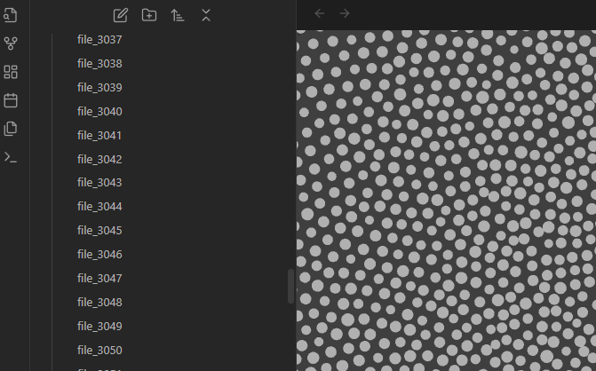

# obsidian-benchmark-vault
----
[](https://github.com/ellerbrock/open-source-badges/) [](https://opensource.org/licenses/MIT)


<!--  -->


<h2 align="center"> vault to stress test obsidians speed with millions of notes
</h2>

<h4 align="center">currently startup times for obsidian can be very long</h4>

---
# TODO
- [ ] deeply nested structure
- [ ] hundres of folders
 
# Installation
### 
```bash
cd ~
git clone https://github.com/wisehackermonkey/obsidian-benchmark-vault.git
cd obsidian-benchmark-vault
```
# Small test just 10 nodes

# 1000 nodes where every one is connected 
## the graph mode is getting slower
## over 1 miniute and the graph hassent settled

### crash obsidan

# after restart its works but takes a while

# a sea of notes! 1000

# its super slow to use

# opeing up the fild list it freezes completly for a good 15 seconds

# But after loading the ui goes back to playing smoothly
# Summary
### -  *[Installation](#Installation)*
<!-- ### -  *[Deveopment](#For-developers)* -->
<!-- ### -  *[Links](#Links)* -->
### -  *[Contributors](#Contributors)*
### -  *[License](#License)*


<!-- 
--------------
# Screenshots
-  
 

-------------- 
# Development
### 
```bash
```

---
# Links
###
-->

--------------
# Contributors

[](https://github.com/wisehackermonkey/obsidian-benchmark-vault/graphs/contributors)

##### Made with [contributors-img](https://contrib.rocks).

--------------


# License

#### MIT © wisehackermonkey


[](https://opensource.org/licenses/MIT)
```bash
by oran collins
github.com/wisehackermonkey
oranbusiness@gmail.com
20240914
```

#### [More of my Projects](https://github.com/wisehackermonkey/)